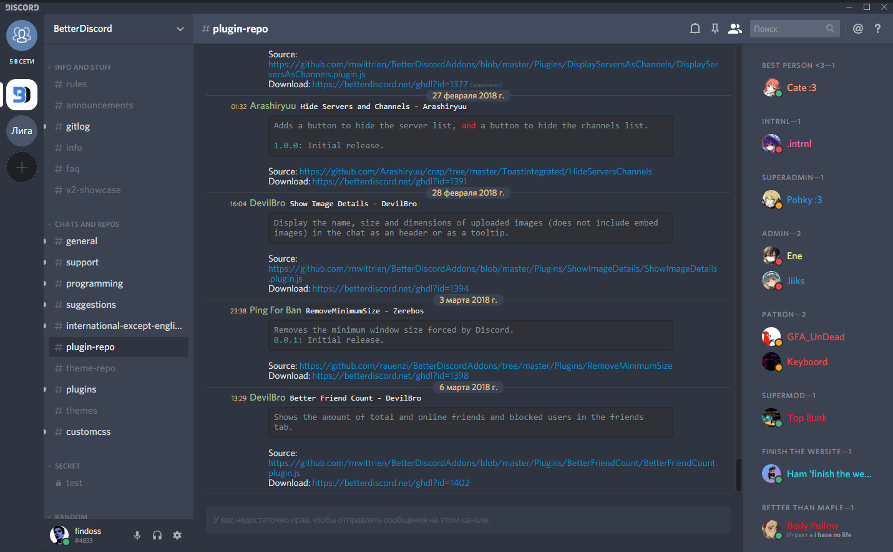

# Nord Discord

An arctic, north-bluish clean and elegant minimal Discord UI.  
Based on the <a href="https://github.com/arcticicestudio/nord">Nord</a> color palette. 

## Preview

## Getting started
**Installation**
  1. Download and install [Better Discord](https://betterdiscord.net/)
  2. Download and install [last release theme](https://github.com/Findoss/Nord-Discord/releases) or build from source 

**Activation**
  1. Open Settings → Themes
  2. Select `Nord theme`

## Contributing
Please read [CONTRIBUTING.md](https://github.com/Findoss/Nord-Discord/CONTRIBUTING.md) for details on our code of conduct, and the process for submitting pull requests to us.

## Authors
 * Nikita Stroganov - Initial work

## License
[MIT.](https://github.com/Findoss/Nord-Discord/LICENSE) Copyright (c) Findoss.
